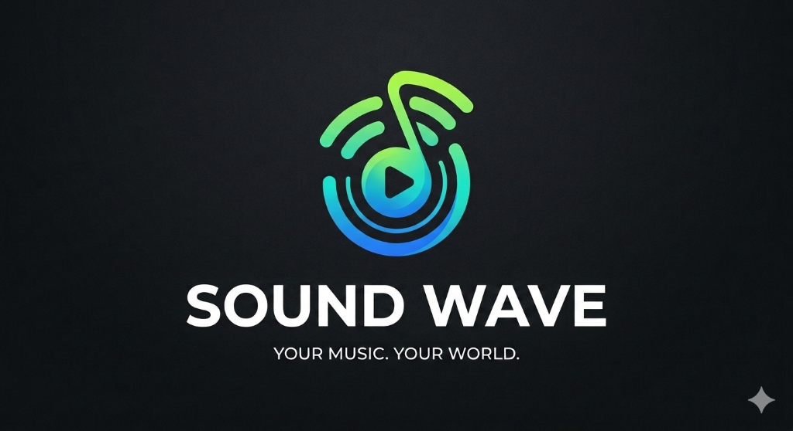
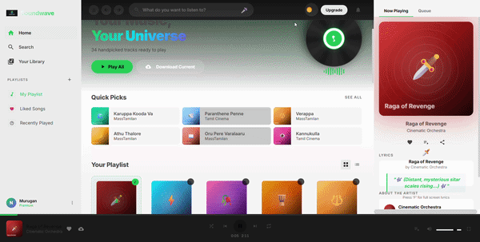
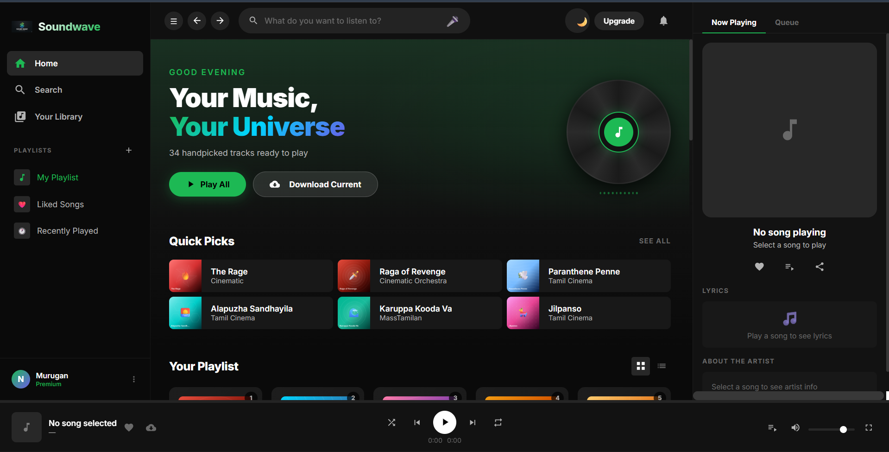
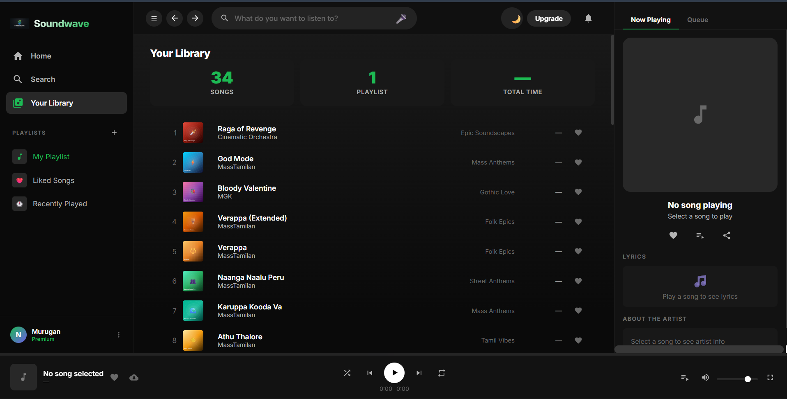
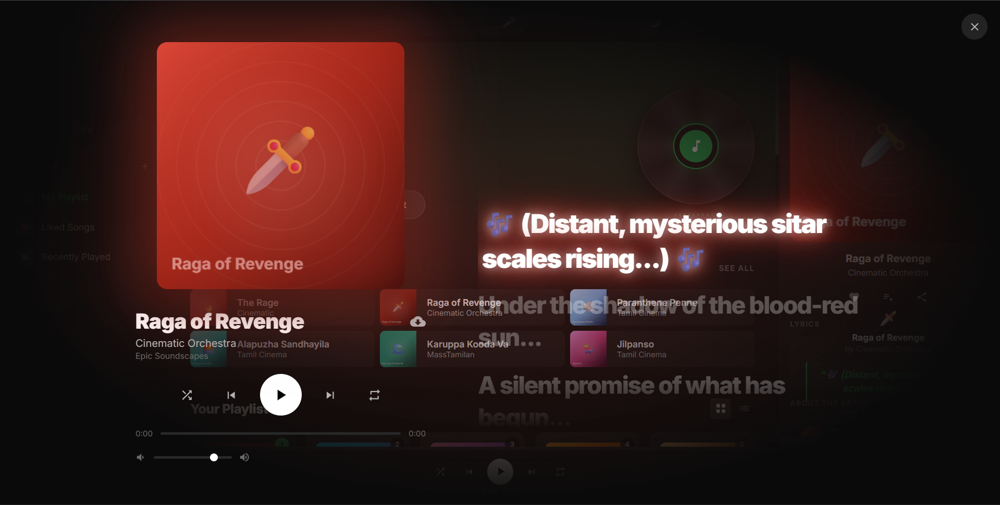

<div align="center">

# 🎵 SoundWave

### Spotify-Inspired Music Player



<p>
A modern, responsive music player built with <b>HTML</b>, <b>CSS</b>, and <b>JavaScript</b>.
</p>

<p>


</p>

<p>

<a href="https://muruanrk.github.io/spotify-clone/">

</a>

<a href="https://github.com/Muruanrk/spotify-clone">

</a>

</p>

</div>

---

# 🌐 Live Demo

### 🔗 https://muruanrk.github.io/spotify-clone/

---

# 🎬 Demo Preview

<p align="center">



</p>

---

# 📸 Screenshots

## 🏠 Home Page

<p align="center">

</p>

---

## 📚 Music Library

<p align="center">

</p>

---

## 🎤 Lyrics Popup

<p align="center">

</p>

---

# 📖 About

**SoundWave** is a modern Spotify-inspired music  player built entirely with HTML, CSS, and JavaScript.

It provides a premium dark user interface, interactive music controls, playlist management, responsive layouts, and an immersive lyrics popup experience.

This project demonstrates frontend development skills, UI design, and responsive web development without using external frameworks.

---

# ✨ Features

### 🎵 Music Player

- ▶ Play & Pause
- ⏮ Previous Track
- ⏭ Next Track
- 🎚 Progress Bar
- 🔊 Volume Control
- 🎧 Now Playing Section

### 📚 Library

- Playlist View
- Recently Played
- Albums
- Artists
- Liked Songs

### 🎨 UI

- Spotify-inspired Design
- Premium Dark Theme
- Responsive Layout
- Sidebar  Navigation
- Search Bar
- Smooth Animations

### 🎤 Lyrics

- Full Screen Lyrics Popup
- Animated Background
- Song Information
- Interactive Controls

---

# 🛠 Tech Stack

| Technology | Purpose |
|------------|----------|
| HTML5 | Structure |
| CSS3 | Styling |
| JavaScript | Functionality |
| Git | Version Control |
| GitHub Pages | Hosting |

---

# 📂 Project Structure

```text
spotify-clone/

│
├── screenshots/
│   ├── demo.gif
│   ├── home.png
│   ├── library.png
│   └── lyrics.png
│
├── index.html
├── style.css
├── app.js
├── logo.png
├── README.md
├── LICENSE
└── .gitignore
```

---

# 🚀 Installation

Clone the repository

```bash
git clone https://github.com/Muruanrk/spotify-clone.git
```

Move into the project

```bash
cd spotify-clone
```

Open

```text
index.html
```

Or use **VS Code Live Server**.

---

# 🎮 How to Use

1. Open the application.
2. Browse the music library.
3. Play a song.
4. Control playback.
5. Open the lyrics popup.
6. Explore playlists.

---

# 🚀 Future Enhancements

- User Login
- Playlist Creation
- Favorite Songs
- Shuffle & Repeat
- Equalizer
- Artist Profiles
- Album Pages
- Search Suggestions
- Backend Integration
- REST API
- Database Support
- Offline Mode

---

# 📊 Project Status

```text
██████████████████████░░ 95%
```

✅ Frontend Completed

🚧 Backend Features Planned

---

# 🤝 Contributing

Contributions are welcome.

1. Fork the repository.
2. Create your feature branch.

```bash
git checkout -b feature-name
```

3. Commit your changes.

```bash
git commit -m "Add new feature"
```

4. Push the branch.

```bash
git push origin feature-name
```

5. Open a Pull Request.

---

# 👨‍💻 Developer

## Murugan RK

🎓 AI & Data Science Student

- GitHub: https://github.com/Muruanrk

---

# ⭐ Support

If you like this project:

⭐ Star this repository

🍴 Fork it

📢 Share it

---

# 📄 License

This project is licensed under the **MIT License**.

---

<div align="center">

### ❤️ Thanks for visiting!

If you enjoyed this project, please consider giving it a ⭐.

</div>
